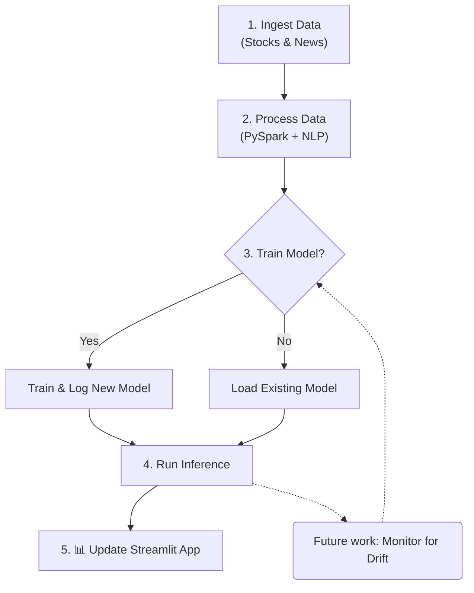

# MLOps Pipeline for Financial Analysis

An automated, end-to-end data pipeline that uses financial news sentiment to inform a stock price prediction model. This project is orchestrated with Apache Airflow and runs entirely in a containerized Docker environment for consistency and scalability.

### Pipeline Architecture

The pipeline runs on a daily schedule, moving from raw data ingestion to a final trained model in distinct stages.

---

### Tech Stack 🛠️

* **Orchestrator:** Apache Airflow (operators: BashOperator, FileSensor, EmptyOperator; uses pendulum)
* **Environment:** Docker & Astro CLI
* **Data Processing:** Apache Spark (`pyspark`)
* **NLP:** Hugging Face Transformers (FinBERT)
* **ML:** `scikit-learn` & `MLflow`
* **Data Sources:** `yfinance`, `parquet`, `CSV`
* **Dashboard:** `Streamlit`
* **Dev & Test:** PyCharm, Jupyter notebooks, pytest (tests/), Git / GitHub

---

### Airflow DAG

---

### Streamlit App
**Link:** https://nlp-finance-forecast-jcvsw7mecpiz2u46w4jq7z.streamlit.app/

---

### How to Run This Project

**Prerequisites:** Docker Desktop & Astro CLI must be installed.

1.  **Clone the repo:** `git clone https://github.com/asupraja3/nlp-finance-forecast.git`
2.  **Navigate to the directory:** `cd nlp-finance-forecast`
3.  **Start the environment:** `astro dev start`

Once running, access the Airflow UI at `http://localhost:8080` (login: `admin`/`admin`).

---

### Future Prospects

* Transition to a real-time streaming architecture with Kafka.
* Implement more advanced time-series models (LSTMs, Transformers).
* Deploy the pipeline to a cloud environment (AWS, GCP, Azure).
* Build a CI/CD pipeline for automated testing and deployment.

  
 
